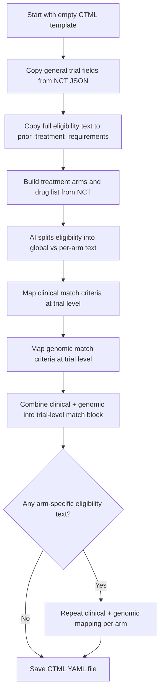

# NCT to CTML mapping guide

This guide explains how a trial downloaded from [ClinicalTrials.gov](https://clinicaltrials.gov) is converted into a **CTML** (Clinical Trial Markup Language) file used by MatchMiner. It is written for reviewers who want to check whether an automated conversion is correct, without reading the source code.

**Input:** A JSON file from the ClinicalTrials.gov API (one file per trial, e.g. `cache/nct/NCT03997435.json`).

**Output:** A YAML CTML file (e.g. `cache/ctml/NCT03997435.yaml` or under `ctml/pending/` / `ctml/reviewed/`).

### Authoritative CTML schema (allowed values)

The **canonical definition** of which values are valid in a CTML file is the MatchMiner API data model:

**[matchminer/data_model.py](https://github.com/sumedhasaxena/matchminer-api/blob/master/matchminer/data_model.py)** (matchminer-api repository)

When reviewing or editing CTML, use these schema objects in that file:

| Schema variable | What it defines |
|-----------------|-----------------|
| [`parent_schema`](https://github.com/sumedhasaxena/matchminer-api/blob/master/matchminer/data_model.py) | Top-level trial document fields (`nct_id`, `phase`, `status`, arms, sponsors, `prior_treatment_requirements`, etc.) |
| [`yaml_clinical_schema`](https://github.com/sumedhasaxena/matchminer-api/blob/master/matchminer/data_model.py) | Allowed values inside `clinical:` match blocks |
| [`yaml_genomic_schema`](https://github.com/sumedhasaxena/matchminer-api/blob/master/matchminer/data_model.py) | Allowed values inside `genomic:` match blocks |

Each field’s `allowed` list in that file is what MatchMiner accepts. If a value is not listed there, the trial YAML may fail validation when loaded.

This guide’s [allowed-values section](#allowed-values-authoritative-schema) notes which match fields nct2ctml populates; it does **not** duplicate `allowed` lists from `data_model.py`.

The local template in `src/ctml_schema.py` only sets initial empty defaults for mapping; it is not the authority on enumerations.

---

## Overview: what happens in order

The conversion runs in several steps. Later steps can depend on earlier ones.



**Important:** Many match fields (diagnosis details, biomarkers, genes) are **not** copied directly from a single NCT field. They are inferred from eligibility text, conditions, keywords, and titles using rules plus AI (large language model) assistance.

---

## Part 1 — General trial information (mostly direct copy)

These fields are taken straight from the NCT JSON, with only light formatting.

| CTML field | ClinicalTrials.gov source | Notes for verification |
|------------|---------------------------|------------------------|
| `nct_id` | `protocolSection.identificationModule.nctId` | Should match the filename (e.g. `NCT03997435`). |
| `long_title` | `protocolSection.identificationModule.officialTitle` | Full official title. |
| `short_title` | `protocolSection.identificationModule.briefTitle` | Brief title. |
| `summary` | `protocolSection.descriptionModule.briefSummary` | Trial summary text. |
| `phase` | `protocolSection.designModule.phases[0]` | First phase listed only (e.g. `PHASE2`). |
| `protocol_target_accrual` | `protocolSection.designModule.enrollmentInfo.count` | Target enrollment number. |
| `principal_investigator_institution` (initial) | `protocolSection.identificationModule.organization.fullName` | May be overwritten if a PI is found (see below). |
| `principal_investigator` (initial) | Set to `NA` | Overwritten when a PI is listed in contacts. |
| `principal_investigator` (if found) | `protocolSection.contactsLocationsModule.overallOfficials` where `role` = `PRINCIPAL_INVESTIGATOR` | Uses `name` and `affiliation` from the first matching official. |
| `principal_investigator_institution` (if PI found) | Same official’s `affiliation` | Replaces the organization default. |
| `curated_on` | `protocolSection.statusModule.studyFirstPostDateStruct.date` | Date trial was first posted. |
| `last_updated` | `protocolSection.statusModule.lastUpdatePostDateStruct.date` | Last update on ClinicalTrials.gov. |
| `study_start_date` | `protocolSection.statusModule.startDateStruct.date` | Only if `startDateStruct.type` is `ACTUAL`; otherwise `null`. |
| `study_completion_date` | `protocolSection.statusModule.completionDateStruct.date` | Only if `completionDateStruct.type` is `ACTUAL`; otherwise `null`. |
| `sponsor_list.sponsor[0].sponsor_name` | `protocolSection.sponsorCollaboratorsModule.leadSponsor.name` | First sponsor entry is marked principal (`is_principal_sponsor: Y`). |

### Fields that stay at template defaults (not from NCT)

These keep the default values from the CTML template:

| CTML field | Default value |
|------------|----------------|
| `age` | `Adults` |
| `data_table4` | `Interventional` |
| `protocol_type` | `INTERVENTIONAL` |
| `status` | `open to accrual` |
| `management_group_list`, `oncology_group_list`, `program_area_list` | Placeholder groups (`Group1`, `Program1`, etc.) |
| `protocol_id` | `0` |
| `protocol_no` | empty |
| `site_list`, `staff_list` | empty |

---

## Part 2 — Prior treatment requirements (verbatim eligibility text)

| CTML field | ClinicalTrials.gov source | How it is built |
|------------|---------------------------|-----------------|
| `prior_treatment_requirements` | `protocolSection.eligibilityModule.eligibilityCriteria` | The full eligibility block is split **line by line**. Lines before “Exclusion Criteria” are copied as-is. Lines after that header are prefixed with `Exclude - `. Empty lines are skipped. |

**How to verify:** Open the NCT record’s eligibility section and compare line-by-line. Inclusion lines should match exactly; exclusion lines should match with the `Exclude - ` prefix.

---

## Part 3 — Treatment arms and drugs

| CTML location | ClinicalTrials.gov source | How it is built |
|---------------|---------------------------|-----------------|
| `treatment_list.step[0].arm[]` | `protocolSection.armsInterventionsModule.armGroups` | One CTML arm per NCT arm group. |
| `arm_code` | `armGroups[i].label` | Same text as on ClinicalTrials.gov (e.g. `Control arm`, `Cohort A`). |
| `arm_description` | `armGroups[i].description` | If missing, `label` is used instead. |
| `arm_internal_id` | Generated | `0`, `1`, `2`, … in order. |
| `arm_suspended` | Fixed | Always `N`. |
| `dose_level[]` | `armGroups[i].interventionNames` | Each intervention name becomes one dose level (`level_description`). |
| `drug_list.drug[]` | All `interventionNames` across arms | De-duplicated list; each unique intervention becomes `{ drug_name: ... }`. |

**How to verify:** Compare the Arms/Interventions section on ClinicalTrials.gov with `arm_code`, `arm_description`, and `dose_level.level_description` in the CTML file.

---

## Part 4 — Match criteria (clinical + genomic)

Match criteria live under:

```yaml
treatment_list:
  step:
  - match:        # trial-level rules (apply to all arms unless overridden)
    - ...
    arm:
    - arm_code: ...
      match:      # optional; only if that arm has arm-specific eligibility text
      - ...
```

### 4.1 Splitting eligibility: global vs per-arm

Before clinical/genomic mapping, an AI step reads:

- Full **inclusion** and **exclusion** text (split at “exclusion criteria” / “exclusion”).
- The list of **arm groups** from NCT (`label`, `description`, interventions).

It returns:

- **Global** inclusion/exclusion snippets — criteria that apply to every arm.
- **Per-arm** snippets — criteria that clearly apply only to one arm (matched by exact `armGroups[i].label`).

Those text blocks drive everything below. If the AI assigns text to the wrong arm, arm-level `match` blocks will be wrong even when trial-level data is right.

**Trial-level mapping** uses global inclusion + exclusion text.

**Arm-level mapping** runs only when a given arm has non-empty arm-specific inclusion or exclusion text; the result is stored on that arm’s `match` field.

### 4.2 Trial-level clinical match fields

These are derived from **global** eligibility text (plus NCT conditions/keywords/titles for diagnosis). Values are placed under `treatment_list.step[0].match` inside a `clinical:` object (possibly combined with `and` / `or` — see [How match logic is structured](#how-match-logic-is-structured)).

| CTML clinical field | Primary NCT / text sources | How the value is obtained |
|---------------------|----------------------------|---------------------------|
| `oncotree_primary_diagnosis` | `protocolSection.conditionsModule.conditions` (+ fallback) | See [Diagnosis (OncoTree)](#diagnosis-oncotree). |
| `age_numerical` | `protocolSection.eligibilityModule.minimumAge` | Only if age is given in **years** (e.g. `18 Years` → `>=18`). Other units are omitted. |
| `gender` | `protocolSection.eligibilityModule.sex` | `MALE` → `Male`, `FEMALE` → `Female`. `ALL` or other values → field omitted. |
| `disease_status` | Global eligibility text + `conditionsModule.keywords` | AI reads text and keywords; values must be in `yaml_clinical_schema` — see [Allowed values](#allowed-values-authoritative-schema). |
| `her2_status`, `er_status`, `pr_status` | Global eligibility text + keywords | AI; only kept if value is a recognized status (see allowed values). |
| `pdl1_status` | Global eligibility text + keywords | Only processed if text/keywords mention PD-L1; then AI; filtered values kept. |
| `mmr_status`, `ms_status` | Global eligibility text + keywords | Only if MMR/MSI-related keywords appear; then AI; filtered values kept. |

Arm-level clinical fields use the **same field names** but only **arm-specific** eligibility text (not NCT conditions list) for diagnosis and biomarkers. Age and gender are **not** re-mapped at arm level.

### 4.3 Genomic match fields

Genomic criteria appear under `genomic:` inside `match` (often nested in `and` / `or`).

Each genomic rule must include at least **`hugo_symbol`** (gene name) and **`variant_category`** (type of alteration). Additional fields—such as `protein_change`, `variant_classification`, `exon`, or `cnv_call`—may be present when the eligibility text supports them. See [`yaml_genomic_schema`](https://github.com/sumedhasaxena/matchminer-api/blob/master/matchminer/data_model.py) for permitted values on every field.

Gene names and synonyms are defined in reference files:

- `ref/genes.txt`
- `ref/synonym_to_gene_symbol.tsv`
- `ref/gene_synonym_addendum.tsv`

**AI** translates the trial’s inclusion and exclusion criteria into structured genomic match blocks in CTML. An optional **enrichment** step may add further detail when the criteria require it (for example exon or copy-number fields).

Permitted field names and values are in [`yaml_genomic_schema`](https://github.com/sumedhasaxena/matchminer-api/blob/master/matchminer/data_model.py). Trials whose eligibility has no gene-related wording usually have no genomic section in the output.

---

## Diagnosis (OncoTree)

`oncotree_primary_diagnosis` uses **OncoTree** cancer type names (from the project’s local reference file), not raw NCT condition strings.

### OncoTree version and reference

| Item | Value |
|------|--------|
| **Version** | `oncotree_2021_11_02` |
| **Browser (by name)** | [OncoTree — oncotree_2021_11_02](https://oncotree.mskcc.org/?version=oncotree_2021_11_02&field=NAME) |
| **Local hierarchy file** | `ref/oncotree_file.txt` (configured as `ONCOTREE_TXT_FILE_PATH` in `config.py`) |

When verifying a diagnosis in CTML, look up the exact **NAME** in that OncoTree release. The converter only proposes values that exist in `ref/oncotree_file.txt` (Level 1 categories and their descendant names used in the mapping steps below).

### Global (trial-level) diagnosis

| Situation | Result in CTML |
|-----------|----------------|
| Conditions include very broad terms (`Cancer`, `Oncology`, `Advanced Cancer`, or `Metastatic Cancer` in the broad sense) | `_SOLID_` and `_LIQUID_` |
| Conditions indicate all solid tumors (e.g. “solid tumor(s)”, “solid malignancies”, `Malignant Neoplasm`, `Neoplasms`) | `_SOLID_` only |
| Specific cancer type(s) listed | Multi-step AI + OncoTree mapping (below) |
| No diagnosis can be determined after all steps | Conversion **fails** (error logged; file may not be produced) |

**Mapping steps for specific conditions:**

1. Read `conditionsModule.conditions` from NCT.
2. **Stage 1 — Level 1 OncoTree:** AI maps each condition to the closest **Level 1** OncoTree category (from the reference file).
3. **Stage 2 — Child diagnoses:** For each Level 1 match, possible **Level 2+** OncoTree terms are collected from the reference hierarchy.
4. **Stage 3 — Pick specific diagnosis:** AI maps each NCT condition to one or more specific OncoTree diagnosis names from those children.
5. **Fallback:** If nothing is found from conditions alone, the tool retries using **keywords**, **official title**, and **brief title** (same Level 1 → child process).

Entries mapped to empty or `"other"` are skipped.

**Multiple diagnoses:** If more than one OncoTree diagnosis applies, the CTML uses an `or` of separate `clinical.oncotree_primary_diagnosis` entries.

### Arm-level diagnosis

If an arm has its own eligibility text, diagnosis is inferred **only from that arm’s text** (not from NCT conditions). The same Level 1 → child AI process is used. If no diagnosis is found, the arm may have no `oncotree_primary_diagnosis` in its match block.

### Special OncoTree placeholders

| Value | Meaning |
|-------|---------|
| `_SOLID_` | Trial accepts solid tumors broadly |
| `_LIQUID_` | Trial accepts liquid/hematologic tumors broadly |

---

## Allowed values (authoritative schema)

**Source of truth:** [matchminer/data_model.py](https://github.com/sumedhasaxena/matchminer-api/blob/master/matchminer/data_model.py)

| Schema | Used for |
|--------|----------|
| [`yaml_clinical_schema`](https://github.com/sumedhasaxena/matchminer-api/blob/master/matchminer/data_model.py) | Allowed values on each field under `clinical:` |
| [`yaml_genomic_schema`](https://github.com/sumedhasaxena/matchminer-api/blob/master/matchminer/data_model.py) | Allowed values on each field under `genomic:` |
| [`yaml_match_schema`](https://github.com/sumedhasaxena/matchminer-api/blob/master/matchminer/data_model.py) | `and` / `or` match structure |
| [`parent_schema`](https://github.com/sumedhasaxena/matchminer-api/blob/master/matchminer/data_model.py) | Top-level trial document fields |

Do **not** rely on copied enum lists in this guide—they can go out of date. For each field, use the `allowed` list (if present) on that field in `data_model.py`.

The clinical table below notes which fields **nct2ctml** tends to populate. Genomic fields are summarized in [§ 4.3](#43-genomic-match-fields). MatchMiner may define additional clinical or genomic fields that can be added manually in YAML.

### Clinical match fields (`yaml_clinical_schema`)

Each entry lives under `clinical:`. **Allowed values** are defined in [`yaml_clinical_schema`](https://github.com/sumedhasaxena/matchminer-api/blob/master/matchminer/data_model.py).

| Field | Populated by nct2ctml? | Notes |
|-------|-------------------------|--------|
| `oncotree_primary_diagnosis` | Yes | OncoTree name or `_SOLID_` / `_LIQUID_`; not an enum in `data_model.py` — see [Diagnosis (OncoTree)](#diagnosis-oncotree) |
| `age_numerical` | Yes | From NCT minimum age when unit is years (e.g. `>=18`) |
| `gender` | Yes | From NCT sex; only maps `Male` / `Female` (other NCT sex values omitted) |
| `disease_status` | Yes | AI from global eligibility + keywords - Currently this field is not involved in matching the criteria to patients
| `her2_status`, `er_status`, `pr_status` | Yes | AI; values not in schema `allowed` or `Unknown` are dropped by the converter |
| `pdl1_status` | Sometimes | AI only if PD-L1 keywords appear in text/keywords |
| `mmr_status`, `ms_status` | Sometimes | AI only if MMR/MSI keywords appear |
| `muscle_invasion_status`, `mgmt_promoter_status` | Pending | Not yet implemented in nct2ctml; allowed values in `yaml_clinical_schema` when added |

Where the schema allows a leading `!` on a status, it means the patient must **not** have that status.

### Genomic match fields (`yaml_genomic_schema`)

Each rule is an object under `genomic:` with required `hugo_symbol` and `variant_category` (see [§ 4.3](#43-genomic-match-fields)). **Allowed values** for all genomic fields are in [`yaml_genomic_schema`](https://github.com/sumedhasaxena/matchminer-api/blob/master/matchminer/data_model.py).

### Match structure (`yaml_match_schema`)

Nested `and` / `or` blocks may contain `clinical`, `genomic`, or further `and` / `or` entries. See `yaml_match_schema` in [data_model.py](https://github.com/sumedhasaxena/matchminer-api/blob/master/matchminer/data_model.py).

### Other trial-level fields (`parent_schema`)

Trial-level fields (`nct_id`, `phase`, `status`, sponsor flags, arm `*_suspended`, etc.) are defined in [`parent_schema`](https://github.com/sumedhasaxena/matchminer-api/blob/master/matchminer/data_model.py). Use that file for any `allowed` lists.

nct2ctml sets `status` to `open to accrual` by default and may set `closed` from `cache/nct/trial_status.csv`.

---

## How match logic is structured

Understanding nested `and` / `or` helps manual review.

| Pattern | Meaning |
|---------|---------|
| Single `clinical: { ... }` | All listed clinical fields must match (AND). |
| `or:` of multiple `clinical:` blocks | Patient can match **any one** diagnosis (common for multiple OncoTree types). |
| `and:` of `clinical` + `genomic` | Patient must satisfy **both** clinical and genomic parts. |
| `or:` under `genomic` | Patient needs **any one** of the listed genomic alternatives (typical for “KRAS **or** PTEN”). |
| `and:` under `genomic` (exclusions) | Patient must **not** match any listed excluded genomic profile. |
| `match` on an `arm` | Overrides or adds to trial-level rules for patients assigned to that arm (when arm-specific criteria exist). |

**Example (simplified):** Trial accepts metastatic solid or liquid tumors, age ≥19, and requires KRAS mutation **or** PTEN homozygous deletion — you would see nested `and` / `or` similar to reviewed trials under `ctml/reviewed/`.

---

## Manual verification checklist

Use this when reviewing a generated CTML file against the NCT record.

### Quick identity check
- [ ] `nct_id`, titles, phase, accrual, sponsor, and dates match ClinicalTrials.gov.
- [ ] `prior_treatment_requirements` matches eligibility text (inclusion plain, exclusion with `Exclude - `).

### Arms and drugs
- [ ] Each NCT arm appears with correct `arm_code` and interventions in `dose_level` / `drug_list`.

### Diagnosis
- [ ] NCT **Conditions** (and title/keywords if conditions are vague) support each `oncotree_primary_diagnosis`.
- [ ] Broad “solid tumor basket” trials show `_SOLID_` (and possibly `_LIQUID_`) where appropriate.
- [ ] Arm-level diagnoses (if any) match **that arm’s** cohort wording in eligibility, not another cohort.

### Clinical match
- [ ] Minimum age on NCT matches `age_numerical` (years only).
- [ ] Sex restriction matches `gender` (if present).
- [ ] Disease stage words in eligibility (metastatic, recurrent, untreated, etc.) match `disease_status`.
- [ ] HER2/ER/PR/PD-L1/MMR/MSI statements in eligibility match biomarker fields (if present).

### Genomic match
- [ ] Every genomic entry has **`hugo_symbol`** and **`variant_category`**; extra fields only where eligibility supports them.
- [ ] Gene and variant wording in eligibility matches the CTML (compare to `yaml_genomic_schema` in `data_model.py`).

### Arm-specific criteria
- [ ] If cohorts differ by biomarker or diagnosis, check per-arm `match` on the correct `arm_code`.
- [ ] Trial-level `match` reflects criteria that apply to **all** arms.

---

## Where to look on ClinicalTrials.gov

| What you are checking | NCT page section / API path |
|------------------------|----------------------------|
| Titles, phase, enrollment | Study Identification, Study Design |
| Conditions | Conditions |
| Keywords | Conditions (keywords) |
| Eligibility (age, sex, criteria text) | Eligibility |
| Arms and interventions | Arms and Interventions |
| Sponsor, dates, status | Sponsor, Study Status |
| Principal investigator | Contacts and Locations (officials) |

---

## Related documentation

- **CTML allowed values (authoritative):** [matchminer/data_model.py](https://github.com/sumedhasaxena/matchminer-api/blob/master/matchminer/data_model.py) — `parent_schema`, `yaml_clinical_schema`, `yaml_genomic_schema`, `yaml_match_schema`
- CTML mapping defaults (not enumerations): `src/ctml_schema.py`
- Manual CTML creation when a trial is **not** on ClinicalTrials.gov: `doc/trial_creation_guide.md`

---

## Limitations (good to know when reviewing)

1. **AI-assisted fields** (diagnosis, biomarkers, genes, arm split) can be wrong or incomplete; always compare to the full eligibility PDF/text.
2. **Gender** is omitted unless NCT sex is strictly male or female.
3. **Genomic mapping is skipped** if no gene names/synonyms appear in the relevant eligibility text.
4. **PD-L1 “Unknown”** and some HER2 “Unknown” AI outputs are intentionally dropped.
5. Conversion **fails** if no OncoTree diagnosis can be determined at trial level (no `_SOLID_`/`_LIQUID_` shortcut and no successful condition/title mapping).

If automated output is wrong, curators typically edit the YAML manually and move it to `ctml/reviewed/` per the workflow in `doc/trial_creation_guide.md`.
